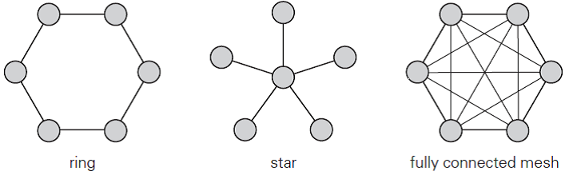
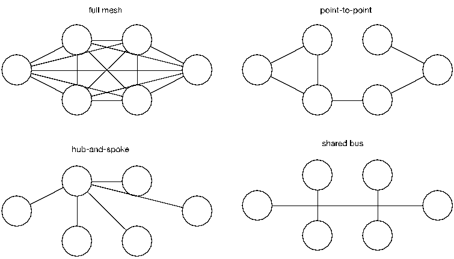

# Tipos y Clasificacion

Existen diversos criterios para clasificar las redes, que pueden basarse en su disposición física, el funcionamiento de los dispositivos, y enfoques lógicos y matemáticos en su implementación. A continuación, se presentan las principales formas de clasificación.

## Area Geografica

Especificacion utilizada para determinar el alcance de las redes, independientemente de la forma en la que se encuentren interconectados los dispositivos.

| Red | Implementacion |
|--|--|
| *PAN* | Personal Area Network *(Cercania Pocos Metros)* |
| **LAN** | Local Area Network *(Red de localizacion Privada)* |
| *CAN* | Campus Area Network *(Facultad / Base Militar / Hospital)* |
| *MAN* | Metropolitan Area Network *(Interconexion Publica)* |
| **WAN** | Wide Area Network *(Satelitales / Interoceánicas / Internet)* |
| *SAN* | Storage Area Network *(Servidores / Matrices de Discos)* |
| *VLAN* | Virtual LAN *(Division Logica de la Red)* |

## Jerarquia

Clasificacion que determina la funcion que cumplen los dispositivos dentro de la red y su implementacion segun los requisitos de seguridad, para la distribucion de las tareas.

| Arquitectura | Funcionamiento |
|--|--|
| **Client/Server** | Modelo que basa su funcionamiento en proveedores de recursos o servicios y equipos que demandan el acceso o uso de los mismo. |
| **Peer To Peer** | Modelo que implementa el uso de dispositivos sin roles definidos, una red entre pares es mas facil de configurar debido a su simplicidad. |

## Medios Utilizados

Diferenciacion de la forma en la que se encuentran interconectados los dispositivos de la red y a la vez se subdividen segun las diferentes tecnologias implementadas.

| Guiados o Cableados | No Guiados o Inalambricos |
|--|--|
| Coaxial | Infrarrojo |
| UTP/STP | Ondas de Radio |
| Fibra Optica | Microondas |

## Topologia

Mapa que describe la forma en la que se intercambian datos entre los dispositivos de red, se divide segun su representacion en el espacio y su representacion matematica a nivel logico.

| Tipo | Representacion |
|--|--|
| **Fisica** | Forma en la que se encuentran conectados los dispositivos de la red y la disposicion de los mismos dentro de las instalaciones |
| **Logica** | Forma en la que produce el intercambio de datos segun los niveles de funcionamiento de cada dispositivo |

En ambos casos se aplica la misma clasificacion de la topologia segun la forma generada en el mapa grafico, dependiendo del area abarcada por la red.

### Topologias LAN (Local Area Network)

| Tipo | Descripción | Ventajas | Desventajas |
|-|-|-|-|
| **Bus** | Todos los dispositivos comparten el mismo canal de comunicaciones | Implementacion Sencilla y económica para instalaciones pequeñas | Difícil diagnosticar problemas, si falla el bus la red se cae |
| **Token Ring** | Los dispositivos se interconectan entre si y utilizan un token para enviar datos | Al utilizar el control del acceso al medio, preve y detecta colisiones | Si se rompe el anillo, toda la red se interrumpe |
| **Star** | Todos los dispositivos se conectan a un nodo central como un switch o hub | Fácil de instalar y gestionar, si un dispositivo falla no afecta a otros | Dependencia del nodo central, si este falla la red deja de funcionar |

### Topologias WAN (Wide Area Network)

| Tipo | Descripción | Ventajas | Desventajas |
|-|-|-|-|
| **Point to Point** | Comunicación directa entre dos dispositivos | Facil de implementar, con bajo costo en conexiones directas | Escalabilidad limitada y solo permite conectar dos puntos |
| **Hub & Spoke**  | Dispositivos se interconectan a través de un nodo central | Fácil de gestionar y se puede añadir o quitar dispositivos sin interrumpir la red | Si el hub falla, todos los nodos conectados quedan fuera de servicio |
| **Full Mesh** | Todos los dispositivos se interconectan entre sí mediante un enlace | Alta redundancia y fiabilidad, si un enlace falla los datos pueden tomar otro camino | Costoso y complejo de implementar, requiere más cableado y dispositivos. |

[volver al inicio](./readme.md)